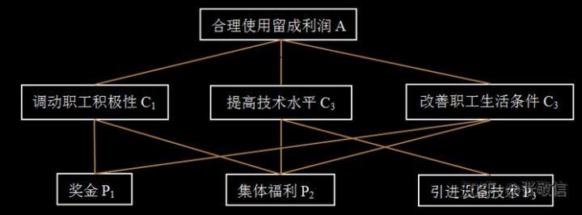

## 某工厂有一笔企业留成利润，需要决定如何分配使用。已经决定有三种用途：奖金、集体福利措施、引进技术设备。考察准则也有三个：是否能调动职工的积极性、是否有利于提高技术水平、考虑改善职工生活条件。建立如下图所示层次模型：

```python
import numpy as np
from analytic_hierarchy_process import AHP

# 准则层判断矩阵
A = np.array([[1, 5, 3],
                [1 / 5, 1, 1 / 3],
                [1 / 3, 3, 1]])
ahp = AHP(A)
weightVector_1 = ahp.getWeightVector()
# 方案层判断矩阵
B1 = np.array([[1, 1/3], [3, 1]])
B2 = np.array([[1, 1 / 5], [5, 1]])
B3 = np.array([[1, 3], [1 / 3, 1]])
weightMat = np.zeros((3, 3))
# 与准则无关的方案列表
zeroIndex_list = [2, 0, 2]
for i in range(len(zeroIndex_list)):
    ahp.setJudgetmentMat([B1, B2, B3][i])
    weightVector = ahp.getWeightVector()
    weightVector = np.insert(weightVector, zeroIndex_list[i], 0)
    weightMat[i, :] = weightVector
# 层次总排序
finalWeightVector = weightMat @ (weightVector_1.T)
print('层次总排序：',finalWeightVector)
```